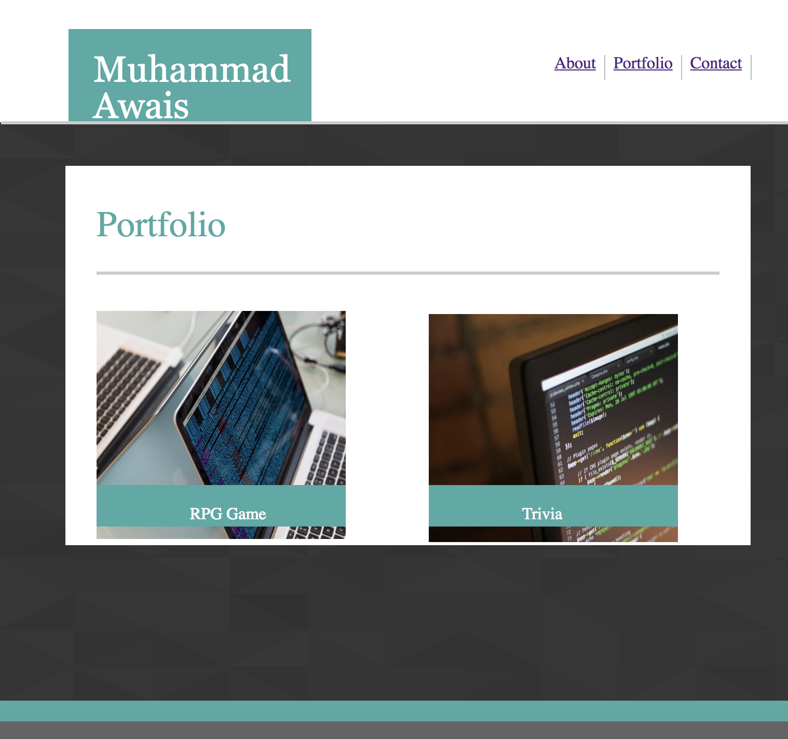

# Responsive-Portfolio

Portfolio website update with media queries.

Each page layout set to three width sides
    
    - 980px 
    - 768px (tablet size)
    - 640px (phone size)

# Link to deployed site
[Responsive-Portfolio](file:///Users/muhammadawais/Desktop/Responsive-Portfolio/)

# Images



# Technology Used
- HTML
- CSS
- Media Query

# Code Snippets
```
<meta name="viewport" content="width=device-width, initial-scale=1, shrink-to-fit=no">

@media screen and (max-width: 768px)
{
    /*Index/ about me page*/
    .name{
        margin-left: 70px;
        width: 210px;
    }
    .box1
    {
        margin-left: 70px;
        width: 660px;
        height: 620px;
    }
}

```
# Author
[Muhammad Awais](https://github.com/mawais54013/Responsive-Portfolio)